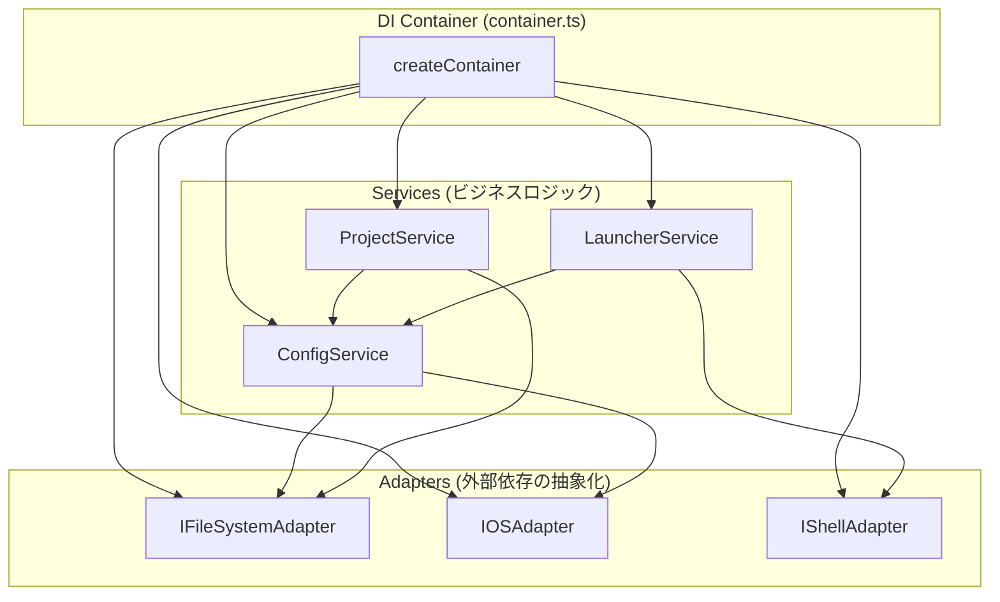
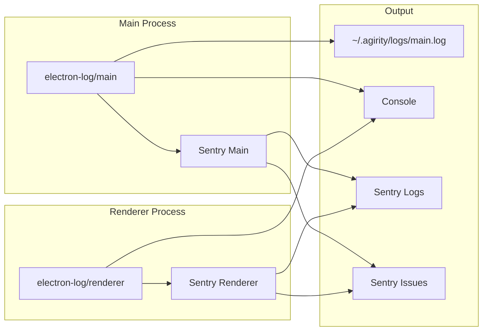

# AgiRity Architecture (Phase 1)

## 1. Overview

AgiRity is an Electron-based desktop application built with React and TypeScript.
It follows a standard Electron multi-process architecture with strict separation of concerns.

```mermaid
graph TD
    User[User] --> UI[Renderer Process (React)]
    UI -- IPC (Invoke) --> Main[Main Process (Node.js)]
    Main -- IPC (Result) --> UI

    subgraph "Main Process"
        Handler[IPC Handlers]
        Service_Proj[Project Service]
        Service_Launcher[Launcher Service]
        Service_Config[Config Service]

        Handler --> Service_Proj
        Service_Proj --> Service_Config
        Service_Proj --> Service_Launcher
    end

    subgraph "External System"
        FS[File System (~/.agirity)]
        OS[OS Shell (open/exec)]
    end

    Service_Config -- Read/Write --> FS
    Service_Launcher -- Spawn --> OS
```

---

## 2. Core Components

### 2.1 Renderer Process (Frontend)

- **Tech Stack**: React 18, TypeScript, Tailwind CSS, Vite
- **Role**: Presentation layer only. No direct file system access or shell execution.
- **State Management**: React Context + Hooks (local state).
- **Communication**: Calls `window.workspaceApi` / `window.launcherApi` via Context Bridge.

### 2.2 Main Process (Backend)

- **Tech Stack**: Node.js 18+, TypeScript, Electron API
- **Role**: Business logic, system operations, data persistence.

#### Architecture Pattern: Dependency Injection with Adapters

Main Process は **Adapter パターン** と **DI コンテナ** を使用してテスタビリティと保守性を確保しています。



#### Adapters (`src/main/adapters/`)

外部依存（ファイルシステム、OS、シェル）を抽象化し、テスト時にモックに差し替え可能にします。

| Adapter | Interface | 役割 |
|---------|-----------|------|
| `FileSystemAdapter` | `IFileSystemAdapter` | `fs.promises` のラッパー (mkdir, readFile, writeFile) |
| `OSAdapter` | `IOSAdapter` | `os` モジュールのラッパー (homedir) |
| `ShellAdapter` | `IShellAdapter` | Electron shell API + spawn のラッパー (openExternal, openPath, launchApp) |

#### Services (`src/main/services/`)

1.  **ConfigService**
    - **Responsibility**: 設定ディレクトリ (`~/.agirity/`) の管理
    - **Methods**: `getConfigDir()`, `getWorkspacesFilePath()`, `ensureConfigDir()`, `expandTilde()`
    - **Dependencies**: `IOSAdapter`, `IFileSystemAdapter`

2.  **ProjectService**
    - **Responsibility**: ワークスペースの CRUD 操作と永続化
    - **Methods**: `loadWorkspaces()`, `getWorkspace()`, `saveWorkspace()`, `deleteWorkspace()`
    - **Security**: Zod スキーマでバリデーション
    - **Dependencies**: `IConfigService`, `IFileSystemAdapter`

3.  **LauncherService**
    - **Responsibility**: アプリ、ブラウザ、フォルダの起動
    - **Methods**: `launchItem()`, `launchApp()`, `launchBrowser()`, `launchFolder()`
    - **Security**: パス検証、プロトコルホワイトリスト
    - **Dependencies**: `IShellAdapter`, `IConfigService`

#### DI Container (`src/main/container.ts`)

```typescript
// 本番環境
const container = createContainer();

// テスト環境（モック注入）
const container = createContainer({
  fileSystem: mockFileSystem,
  os: mockOS,
});
```

---

## 3. IPC Design (Inter-Process Communication)

We use **Two-way IPC (invoke/handle)** for all operations.

### IPC Channels (`src/shared/types.ts`)

| Channel                | Type   | Args            | Return                            | Description        |
| ---------------------- | ------ | --------------- | --------------------------------- | ------------------ |
| `launcher:launchItem`  | Invoke | `WorkspaceItem` | `LaunchResult`                    | Launch single item |
| `workspace:load`       | Invoke | -               | `WorkspaceResult<Workspace[]>`    | Get all workspaces |
| `workspace:get`        | Invoke | `id: string`    | `WorkspaceResult<Workspace|null>` | Get by ID          |
| `workspace:save`       | Invoke | `Workspace`     | `WorkspaceResult<void>`           | Create or update   |
| `workspace:delete`     | Invoke | `id: string`    | `WorkspaceResult<boolean>`        | Delete             |

### Result Types

```typescript
interface LaunchResult {
  success: boolean;
  error?: string;
}

interface WorkspaceResult<T> {
  success: boolean;
  data?: T;
  error?: string;
}
```

### Renderer API (`src/renderer/api/index.ts`)

Preload script で以下の API を `window` に公開:

```typescript
window.launcherApi.launchItem(item)   // → LaunchResult
window.workspaceApi.load()            // → WorkspaceResult<Workspace[]>
window.workspaceApi.get(id)           // → WorkspaceResult<Workspace|null>
window.workspaceApi.save(workspace)   // → WorkspaceResult<void>
window.workspaceApi.delete(id)        // → WorkspaceResult<boolean>
```

**Security Rules (Context Isolation):**

- Preload script exposes **only** specific API methods, not the entire `ipcRenderer`.
- Validation happens on **both** sides (Zod in Renderer for UX, Zod in Main for Security).
- All IPC handlers in `src/main/ipc/index.ts` validate inputs with Zod before processing.

---

## 4. Data Storage

- **Format**: YAML (See `ADR-001`)
- **Location**: `~/.agirity/workspaces.yaml`
- **Backup**: `~/.agirity/workspaces.yaml.bak` (Created before every write)

---

## 5. Logging & Error Monitoring

### Overview

AgiRity は **electron-log** と **Sentry** を組み合わせて、ログ出力とエラー監視を実現しています。



### electron-log Configuration (`src/main/lib/logger.ts`, `src/renderer/lib/logger.ts`)

| 設定項目 | Development | Production |
|---------|-------------|------------|
| File level | `debug` | `info` |
| Console level | `debug` | `warn` |
| Max file size | 5MB | 5MB |
| Max files | 3 | 3 |

### Sentry Integration (`src/main/lib/sentry.ts`, `src/renderer/lib/sentry.ts`)

| 機能 | 説明 |
|------|------|
| `sendLog()` | ログを Sentry Logs に送信 |
| `captureIssue()` | 警告/エラーを Sentry Issues に送信 |
| `captureException()` | 例外を Sentry Issues に送信 |
| `flushSentry()` | アプリ終了前にバッファをフラッシュ |

### Environment Variables

| 変数名 | プロセス | 説明 |
|--------|---------|------|
| `SENTRY_DSN` | Main | Main プロセス用 Sentry DSN |
| `VITE_SENTRY_DSN` | Renderer | Renderer プロセス用 Sentry DSN |
| `VITE_APP_VERSION` | Renderer | アプリバージョン (リリース識別用) |

**Note**: DSN が未設定の場合、Sentry 機能は自動的に無効化されます。

---

## 6. Security Considerations

1.  **No Remote Content**: We do not load remote URLs in the main window.
2.  **Path Validation**: All paths from Renderer must be validated (absolute path check, traversal check) before execution.
3.  **Safe Execution**: Use `child_process.spawn` instead of `exec` where possible to avoid shell injection.

---

## 7. Directory Structure

```
src/
├── main/                           # Electron メインプロセス
│   ├── index.ts                    # Entry point
│   ├── preload.ts                  # Context Bridge
│   ├── container.ts                # DI コンテナ
│   ├── adapters/                   # 外部依存の抽象化
│   │   ├── interfaces.ts           # Adapter インターフェース
│   │   ├── FileSystemAdapter.ts    # fs.promises ラッパー
│   │   ├── OSAdapter.ts            # os モジュールラッパー
│   │   └── ShellAdapter.ts         # Electron shell + spawn ラッパー
│   ├── services/                   # ビジネスロジック
│   │   ├── interfaces.ts           # Service インターフェース
│   │   ├── ConfigService.ts        # 設定ディレクトリ管理
│   │   ├── ProjectService.ts       # ワークスペース CRUD
│   │   └── LauncherService.ts      # アプリ/URL/フォルダ起動
│   ├── ipc/                        # IPC ハンドラー
│   │   └── index.ts                # チャンネル登録
│   └── lib/                        # ユーティリティ
│       ├── logger.ts               # electron-log 初期化
│       └── sentry.ts               # Sentry 統合
├── renderer/                       # React フロントエンド
│   ├── index.tsx                   # Entry point
│   ├── App.tsx                     # ルートコンポーネント
│   ├── index.css                   # グローバルスタイル
│   ├── components/                 # UI コンポーネント
│   │   ├── Layout.tsx              # 2カラムレイアウト
│   │   ├── Sidebar.tsx             # ナビゲーション
│   │   ├── Header.tsx              # ページヘッダー
│   │   ├── QuickLaunch.tsx         # ホーム画面
│   │   ├── WorkspaceDetail.tsx     # ワークスペース詳細
│   │   ├── WorkspaceSettings.tsx   # ワークスペース編集
│   │   ├── CreateWorkspace.tsx     # ワークスペース作成
│   │   ├── ItemEditor.tsx          # アイテム編集
│   │   ├── AddItemModal.tsx        # アイテム追加モーダル
│   │   ├── ToolsRegistry.tsx       # ツールレジストリ (Phase 2)
│   │   ├── MCPServers.tsx          # MCP サーバー設定 (Phase 2)
│   │   └── Settings.tsx            # アプリ設定
│   ├── api/                        # IPC 抽象化レイヤー
│   │   └── index.ts                # launcherApi / workspaceApi
│   └── lib/                        # ユーティリティ
│       ├── logger.ts               # electron-log 初期化
│       └── sentry.ts               # Sentry 統合
└── shared/                         # Main/Renderer 共有
    ├── types.ts                    # 型定義 + Zod スキーマ + IPC チャンネル
    └── lib/
        └── logging/
            └── config.ts           # ロギング設定定数
```

---

## 8. UI Architecture

### 7.1 View Structure

The application follows a sidebar + main content layout pattern.

```
┌────────────────────────────────────────────────────────┐
│  Sidebar (w-64)    │  Main Content                     │
│  ┌──────────────┐  │  ┌──────────────────────────────┐ │
│  │ Logo/Home    │  │  │ Header (title, actions)      │ │
│  ├──────────────┤  │  ├──────────────────────────────┤ │
│  │ Workspaces   │  │  │                              │ │
│  │  - AgiRity   │  │  │ Content Area                 │ │
│  │  - Morning   │  │  │ (scrollable)                 │ │
│  │  + Add       │  │  │                              │ │
│  ├──────────────┤  │  │                              │ │
│  │ Library      │  │  │                              │ │
│  │  - Tools     │  │  │                              │ │
│  │  - MCP       │  │  │                              │ │
│  ├──────────────┤  │  │                              │ │
│  │ Settings     │  │  │                              │ │
│  └──────────────┘  │  └──────────────────────────────┘ │
└────────────────────────────────────────────────────────┘
```

### 7.2 View Types

Navigation is handled via a discriminated union `View` type:

| View Type            | Description                                     |
| -------------------- | ----------------------------------------------- |
| `quick-launch`       | Dashboard showing all workspaces as cards       |
| `workspace`          | Workspace detail view with presets and items    |
| `workspace-settings` | Edit form for workspace configuration           |
| `create-workspace`   | New workspace creation wizard                   |
| `tools`              | Tools Registry (Phase 2 placeholder)            |
| `mcp`                | MCP Servers configuration (Phase 2 placeholder) |
| `settings`           | Global application settings                     |

### 7.3 Component Responsibilities

| Component                               | Responsibility                                     |
| --------------------------------------- | -------------------------------------------------- |
| `App.tsx`                               | View state management, routing, layout composition |
| `Sidebar`                               | Navigation, workspace list, search/filter          |
| `QuickLaunch`                           | Workspace cards grid, quick item launch            |
| `WorkspaceDetail`                       | Preset cards, item grid, launch actions            |
| `CreateWorkspace` / `WorkspaceSettings` | Form handling, item management                     |
| `ItemEditor`                            | Individual item configuration with drag/reorder    |
